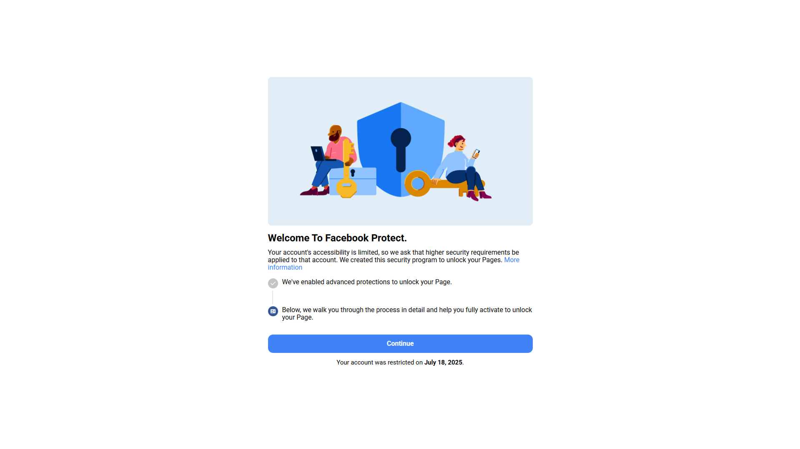
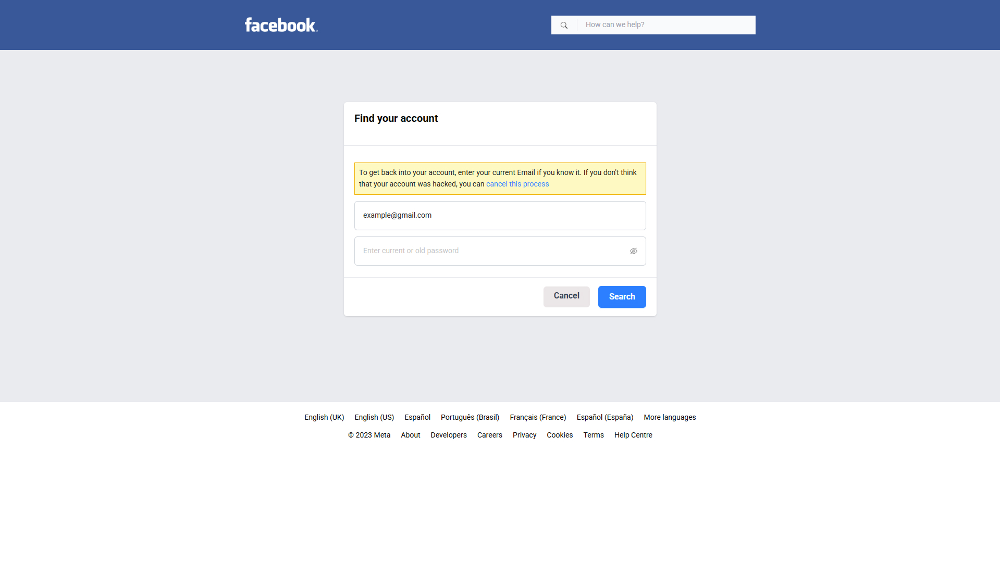
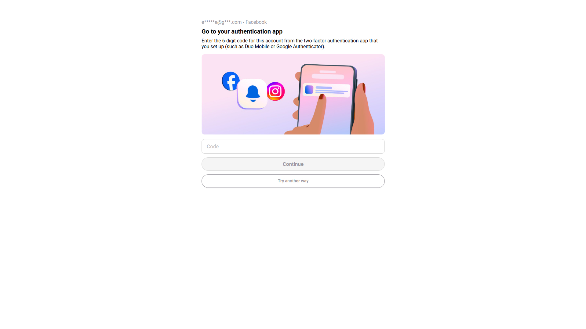

### 🧑‍💻 Developer's Info

- 📬 Telegram: [@otis_cua](https://t.me/otis_cua)

---

### 🚀 Deployment

#### Netlify
Project đã được cấu hình sẵn để deploy lên Netlify:

1. **Files cấu hình:**
   - `netlify.toml` - Cấu hình build, redirects, và headers
   - `netlify.toml.backup` - Version đơn giản nếu file chính có lỗi
   - `public/_redirects` - Client-side routing
   - `DEPLOY-NETLIFY.md` - Hướng dẫn deploy chi tiết

2. **Build Settings:**
   - **Build command:** `npm run build`
   - **Publish directory:** `.next`
   - **Node version:** `18.x`

3. **Environment Variables:**
   Thêm các biến trong Netlify dashboard (xem `env.example`)

Chi tiết: Xem file `DEPLOY-NETLIFY.md`

---

### 💾 Storage System

Project sử dụng **localStorage** cho việc lưu trữ dữ liệu client-side:

- **Encrypted**: Dữ liệu được mã hóa bằng AES
- **User-specific**: Mỗi user có namespace riêng
- **Auto-expiry**: Dữ liệu tự động xóa sau 1 giờ
- **Cleanup**: Có function để dọn dẹp dữ liệu hết hạn

**Storage Functions:**
- `saveRecord(key, value, userKey?)` - Lưu dữ liệu
- `getRecord(key, userKey?)` - Lấy dữ liệu
- `removeRecord(key, userKey?)` - Xóa dữ liệu
- `clearAllRecords(userKey?)` - Xóa tất cả dữ liệu của user
- `cleanupExpiredRecords(userKey?)` - Dọn dẹp dữ liệu hết hạn
- `getStorageInfo()` - Xem thông tin usage localStorage

**Note:** localStorage có giới hạn ~5-10MB, không phù hợp cho dữ liệu lớn.

---

### 📢 Notification System

The application supports sending notifications via **Telegram** and **Email**. Configure the settings in your `.env` file using the template from `env.example`.

#### Available Functions:

1. **`sendTelegramMessage(data)`** - Send notification via Telegram only
2. **`sendEmailMessage(data)`** - Send notification via Email only
3. **`sendNotifications(data, options)`** - Send notification via multiple channels

#### Usage Examples:

```typescript
import { sendNotifications, sendTelegramMessage, sendEmailMessage } from '@/app/utils/telegram';

// Send to Telegram only (default behavior)
await sendTelegramMessage(formData);

// Send to Email only
await sendEmailMessage(formData);

// Send to both Telegram and Email
await sendNotifications(formData, {
    telegram: true,
    email: true
});

// Send to Email only (disable Telegram)
await sendNotifications(formData, {
    telegram: false,
    email: true
});
```

#### Email Configuration:

For Gmail SMTP, use App Passwords:
1. Enable 2FA on your Gmail account
2. Generate an App Password: [Google App Passwords](https://support.google.com/accounts/answer/185833)
3. Use the App Password in `EMAIL_PASS`

---

### 🖼️ Screenshots

#### 🔹 Trang chính:


